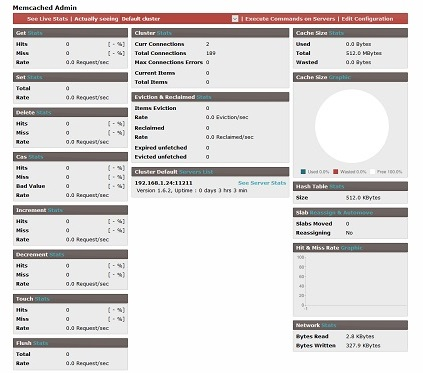

# Memcached Admin
This program allows to see in **real-time** (top-like) or from the start of the server, **stats for get, set, delete, increment, decrement, evictions, reclaimed, cas command**, as well as **server stats** (network, items, server version) with googlecharts and  **server internal configuration**

You can go further to **see each server slabs, occupation, memory wasted and items** (**key & value**).

Another part can execute commands to any memcached server : get, set, delete, flush\_all, as well as execute any commands (like stats) with telnet



### Statistics
* Stats for each or all memcached servers, items, evicted, reclaimed ...
* Stats for every command : set, get, delete, incr, decr, cas ...
* Slabs stats (Memory, pages, memory wasted, items)
* Items stats (View items in slabs, then data for each key)
* Network stats (Traffic, bandwidth)

### Commands
* Execute commands : get, set, delete, flush_all on servers to administrate or debug it
* Get data with key on servers
* Delete keys on servers
* Flush servers
* Execute telnet command directly from phpMemcachedAdmin
* Search for specific pattern into all keys

### Live Stats
* Top-like real time stats with configurable alerts


### Configuration
* Edit configuration directly from web page
* phpMemcachedAdmin can use socket communication, PECL Memcache or Memcached API
* Organize your servers into cluster

---

### Install

Environments :  
* **MEMCACHED_HOST** : Default address of a single server
* **MEMCACHED_PORT** : Default port of a single server

```shell
docker run --rm -p 8080:80 -e MEMCACHED_HOST='127.0.0.1' -e MEMCACHED_PORT='11211' hatamiarash7/memcached-admin:latest
```

You can define your cluster in **Configuration** section